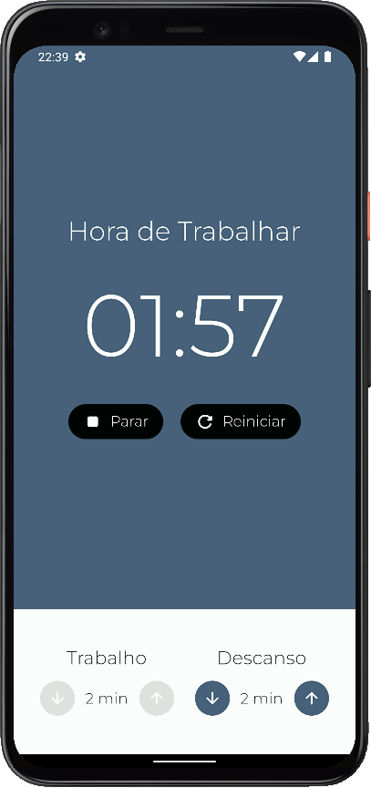
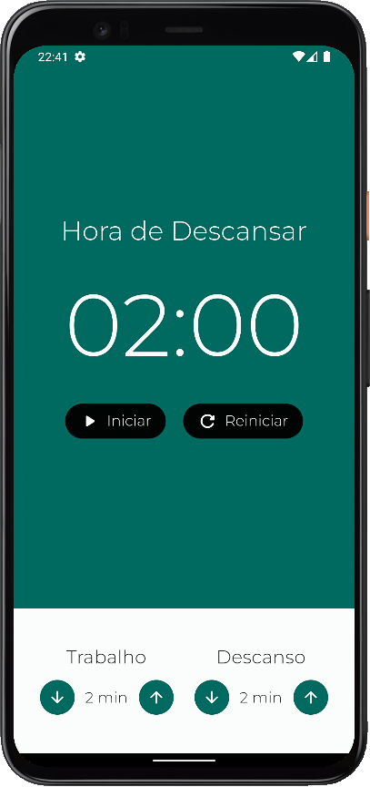

# pomodoro-app

<p align="left">
   
   <!--  -->
   
</p>

App Pomodoro, desenvolvido com a linguagem Dart, framework Flutter e MobX.

## :hammer: Funcionalidades do projeto
* `Tempo de trabalho e descanso:` incremento de tempo a cada 1 min. Mín 1min.
* `Opção de pause e reiniciar:` função para pausar e reiniciar o tempo.

<br>
<div display: inline_block align="center">
   
   
</div>

## :file_folder: Acesso ao projeto
Você pode [acessar o código-fonte do projeto](https://github.com/GabrielSchiavo/pomodoro-app) ou [baixá-lo](https://github.com/GabrielSchiavo/pomodoro-app/archive/refs/heads/main.zip).

## :hammer_and_wrench: Abrir e rodar o projeto
Após baixar o projeto, você pode abrir com o Visual Studio Code. Para o projeto funcionar você deve ter configurado em seu PC:

* Flutter - Versão >=2.18.2 <3.0.0

Abra um terminal na pasta raiz do projeto e execute estes comandos:
```bash
dart pub get
```
```bash
flutter pub get
```

Agora ao abrir o projeto com o Visual Studio Code, abra o arquivo "main.dart" localizado na pasta "lib", agora pode executar ou depurar no seu smartphone, em um emulador Android ou iOS, no Windows ou no navegador.

## :white_check_mark: Tecnologias utilizadas
* `Dart - 2.18.2`
* `Flutter - 3.3.6`
* `MobX - 2.1.3`
* `flutter_mobx - 2.0.6+5`
* `provider - 6.0.4`
* `Material Design 3`
